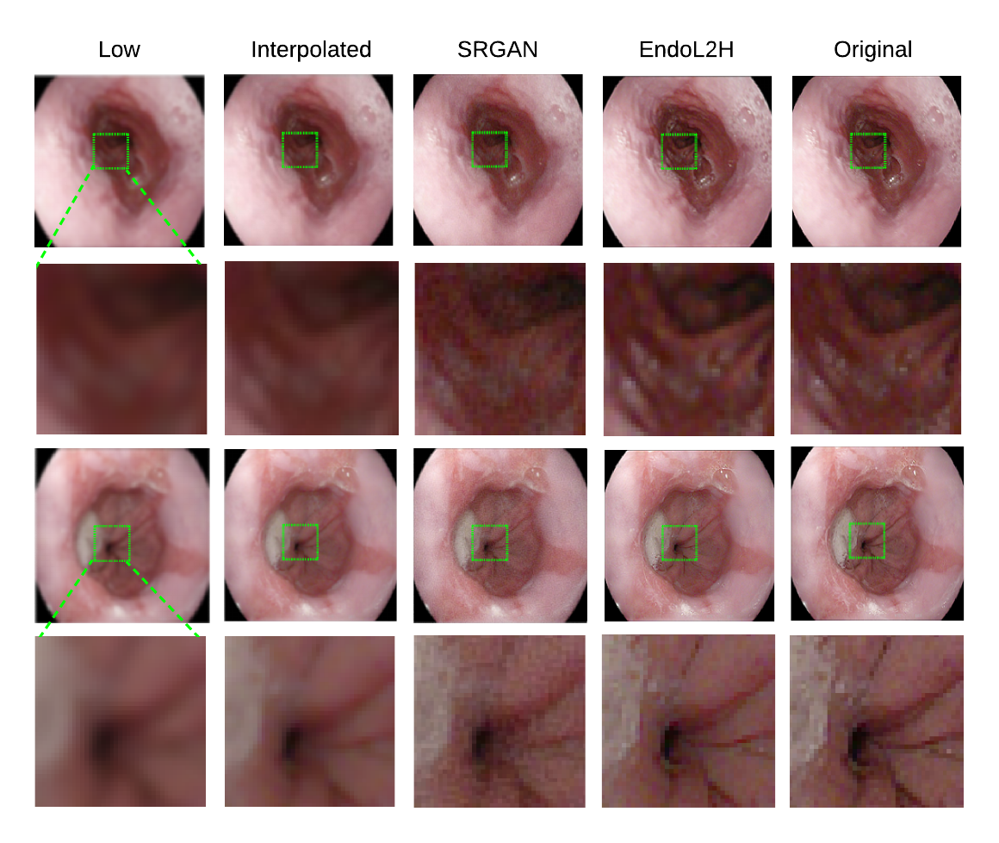
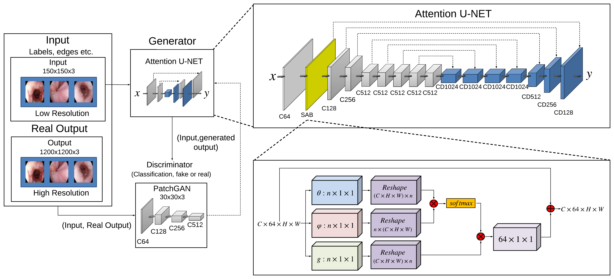

# EndoL2H

Code, dataset, and trained models for "EndoL2H: Deep Super-Resolution for Capsule Endoscopy"

If you use this code, please cite:

Yasin Almalioglu, Abdulkadir Gokce, Kagan Incetan, Muhammed Ali Simsek, Kivanc Ararat, Richard J. Chen,
Nichalos J. Durr, Faisal Mahmood, Mehmet Turan. "EndoL2H: Deep Super-Resolution for Capsule
Endoscopy." [arXiv:2002.05459 (2020)](https://arxiv.org/abs/2002.05459).

#### Summary of Our Work

 

 


## Getting Started

### Installation

- Clone this repo:

```bash
cd ~
git clone https://github.com/akgokce/EndoL2H
cd EndoL2H
```

### Prerequisites

- Linux (Tested on Ubuntu 16.04)
- NVIDIA GPU (Tested on Nvidia P100 using Google Cloud)
- CUDA, CuDNN
- Python 3
- Pytorch>=0.4.0
- torchvision>=0.2.1
- dominate>=2.3.1
- visdom>=0.1.8.3
- scipy

- Install [PyTorch](http://pytorch.org) and 0.4+ and other dependencies (e.g., torchvision, [visdom](https://github.com/facebookresearch/visdom) and [dominate](https://github.com/Knio/dominate)).
  - For pip users, please type the command `pip install -r requirements.txt`.
  - For Conda users, you can use an installation script `./scripts/conda_deps.sh`. Alternatively, you can create a new Conda environment using `conda env create -f environment.yml`.

### Dataset

- Our dataset is a part of [The Kvasir Dataset](https://datasets.simula.no/kvasir/
).
- The data split we used in training can be downloaded [here](https://1drv.ms/u/s!AsXONMc_kIHJb1pqU_1CGv9RBXk?e=5xGbvI).

### Dataset Organization

Data needs to be arranged in the following format:

```python
EndoL2H                 # Path to main folder
└── datasets            # Folder of all datasets
      └── dataset_xxx   # Name of a dataset
            |
            ├── A       # High resolution images
            |   ├── test
            |   ├── train
            |   └── val
            |
            └── B       # Low resolution images
                ├── test
                ├── train
                └── val


```

#### Network Architecture



### Training

 To train a model:

```bash
python train.py --dataroot ./datasets/${nameOfDataset} --name unet_256 --model pix2pix --netG unet_256 --dataset_mode aligned --direction BtoA --preprocess none
```

- To see more intermediate results, check out  `./checkpoints/unet_256/web/index.html`.
- To view training results and loss plots, run `python -m visdom.server` and click the URL <http://localhost:8097.>

### Pre-trained Models

You can download our pretrained model [here](https://1drv.ms/u/s!AsXONMc_kIHJbhEIjkvPpnvxeCg?e=y6NfoA)

- The pretrained model is saved at `./checkpoints/unet_256/latest_net_G.pth`.


### Testing

To test the model:

```bash
python test.py --dataroot ./datasets/${nameOfDataset} --name unet_256 --model pix2pix --netG unet_256 --dataset_mode aligned --direction BtoA --preprocess none
```

- The test results will be saved to a html file here: `./results/unet_256/test_latest/index.html`.

## License

This project is licensed under the MIT License - see the [LICENSE](LICENSE) file for details

## Acknowledgments

This repository is based on [pytorch-CycleGAN-and-pix2pix](https://github.com/junyanz/pytorch-CycleGAN-and-pix2pix).

## Reference

If you find our work useful in your research please consider citing our paper:

```
@article{almalioglu2020endol2h,
    title={EndoL2H: Deep Super-Resolution for Capsule Endoscopy},
    author={Yasin Almalioglu and Abdulkadir Gokce and Kagan Incetan and Muhammed Ali Simsek and Kivanc Ararat and Richard J. Chen and Nichalos J. Durr and Faisal Mahmood and Mehmet Turan},
    journal={arXiv preprint arXiv:2002.05459},
    year={2020}
}
```
