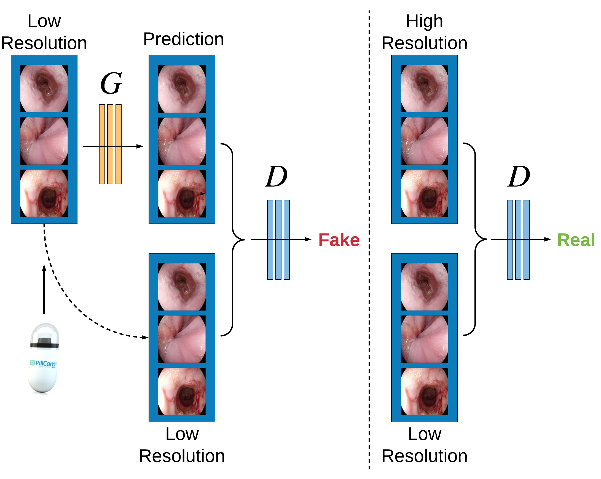
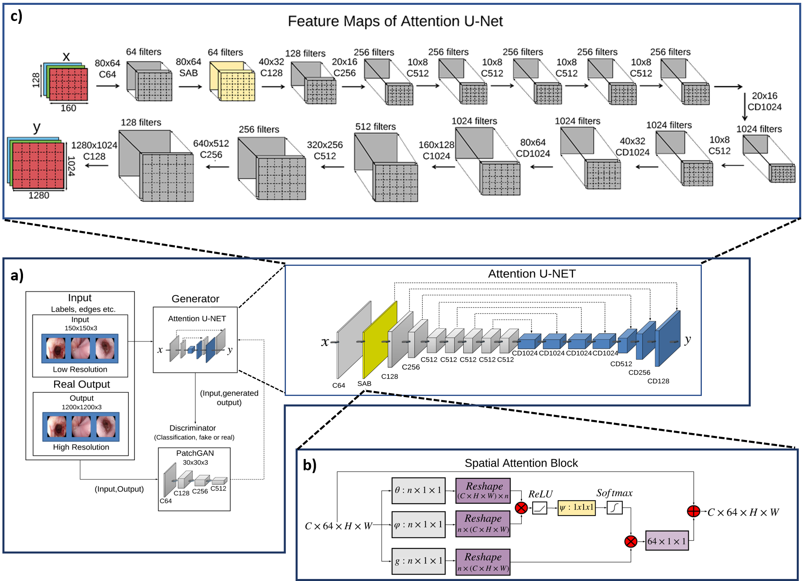

# EndoL2H: Deep Super-Resolution for Capsule Endoscopy

Code, dataset, and trained models for "EndoL2H: Deep Super-Resolution for Capsule Endoscopy"

If you use this code, please cite:


>    Yasin Almalioglu, Kutsev Bengisu Ozyoruk, Abdulkadir Gokce, Kagan Incetan, Muhammed Ali Simsek, Kivanc 
Ararat, Richard J. Chen, Nichalos J. Durr, Faisal Mahmood, Mehmet Turan. "EndoL2H: Deep Super-Resolution 
for Capsule Endoscopy." [arXiv:2002.05459 (2020)](https://arxiv.org/abs/2002.05459). 

## Overview

We propose and quantitatively validate a novel framework to learn a mapping from low-to-high resolution endoscopic images. We combine conditional adversarial networks with a spatial attention block to improve the resolution by up to factors of 8x, 10x, 12x, respectively. EndoL2H is generally applicable to any endoscopic capsule system and has the potential to improve diagnosis and better harness computational approaches for polyp detection and characterization.

Our main contributions are as follows:
  - **Spatial Attention-based Super Resolution cGAN:** We propose a spatial attention based super-resolution cGAN architecture specifically designed and optimized for capsule endoscopy images.
  - **High fidelity loss function:** We introduce *EndoL2H* loss which is a weighted hybrid loss function specifically optimized for endoscopic images. It collaboratively combines the strengths of perceptual, content, texture, and pixel-based loss descriptions and improves image quality in terms of pixel values, content, and texture. This combination leads to the maintenance of the image quality even under high scaling factors up to, 10x-12x.
  - **Qualitative and quantitative study:** We conduct a detailed quantitative analysis to assess the effectiveness of our proposed approach and compare it to alternative state-of-the art approaches.

#### Summary of Our Work 
  
A conditional GAN combined with spatial attention unit maps low resolution(LR) endo-scopic images to diagnostically relevant  high resolution(HR) endoscopic images. Unlike an unconditional GAN, both the generator and discriminator observe the input LR images.

<p align="center">
 
</p>

#### Network Architecture

**a)** Overall system architecture of EndoL2H super-resolution framework. On the left, low resolution image is fed to generator network that creates an estimated high resolution counterpart, which is then served to discriminator. Discriminator network takes both LR image and the corresponding HR image (real or generated), and tries to recognize whether the HR image is real or fake., layers and skip-connections of attention U-Net is depicted in detail, below that, **b)** is the flow diagram of spatial attention block(SAB). On top of the figure **c)** represents the feature maps of attention U-Net which is the summary of applied filters and their input-output tensor sizes. 

<p align="center">
 
</p>

## Getting Started

### 1. Installation

- Clone this repo:

```bash
cd ~
git clone https://github.com/akgokce/EndoL2H
cd EndoL2H
```

### 2. Prerequisites

- Linux (Tested on Ubuntu 16.04)
- NVIDIA GPU (Tested on Nvidia P100 using Google Cloud)
- CUDA, CuDNN
- Python 3
- Pytorch>=0.4.0
- torchvision>=0.2.1
- dominate>=2.3.1
- visdom>=0.1.8.3
- scipy

- Install [PyTorch](http://pytorch.org) and 0.4+ and other dependencies (e.g., torchvision, [visdom](https://github.com/facebookresearch/visdom) and [dominate](https://github.com/Knio/dominate)).
  - For pip users, please type the command `pip install -r requirements.txt`.
  - For Conda users, you can use an installation script `./scripts/conda_deps.sh`. Alternatively, you can create a new Conda environment using `conda env create -f environment.yml`.
  
### 3. Code Base Structure

The code base structure is explained below:
- train.py: Script for image-to-image translation. It works for different models (with option '--model': e.g. pipx2pix, cyclegan, colorization) and various datasets (with option '--dataset_mode': e.g. aligned, unaligned, single, colorization). It creates model, dataset and visualizer given the option. Then, it does training. Use '--continue_train' and '--epoch_count' to resume your previous training. 
- test.py: You can use this script to test the model after training. First, it creates model and dataset given the option. Then, it runs interference for --num_test images and save results to an HTML file. Use '--results_dir' to specify the results directory. 
- networks.py: It contains PyTorch model definitions for all network.
- base_options.py: It defines options used during both training and test time.
- combine_A_and_B.py: pix2pix training requires paired data. It generates training data in the form of pairs of images {A,B}, where A and B are two different depictions of the same underlying scene. Corresponding images in a pair {A,B} must be the same size and have the same filename. Once the data is formatted this way, call:

```bash
python datasets/combine_A_and_B.py --fold_A /path/to/data/A --fold_B /path/to/data/B --fold_AB /path/to/data
```

This will combine each pair of images (A,B) into a single image file, ready for training.
  
### 4. Dataset

- Our dataset is a part of [The Kvasir Dataset](https://datasets.simula.no/kvasir/
).
- The data split we used in training can be downloaded [here](https://drive.google.com/open?id=189-QVefK-uoD9fwypRCIKzDWqh_F69R8).

### 5. Dataset Organization

Data needs to be arranged in the following format:

```python
EndoL2H                 # Path to main folder
└── datasets            # Folder of all datasets
      └── dataset_xxx   # Name of a dataset
            |
            ├── A       # High resolution images
            |   ├── test
            |   |    ├──fold1
            |   |        ├──1.jpg
            |   |        ├──2.jpg
            |   |        ├── ...
            |   |    ├── ...
            |   |    └──fold5
            |   ├── train
            |   |    ├──fold1
            |   |        ├──1.jpg
            |   |        ├──2.jpg
            |   |        ├── ...
            |   |    ├── ...
            |   |    └──fold5        
            |   └── val
            |   |    ├──1.jpg
            |   |    ├──2.jpg
            |   |    ├── ...
            |
            └── B       # Low resolution images
                ├── test
                |    ├──fold1
                |        ├──1.jpg
                |        ├── ...
                |    ├── ...
                |    └──fold5
                ├── train
                |    ├──fold1
                |        ├──1.jpg
                |        ├── ...
                |    ├── ...
                |    └──fold5
                └── val
                     ├──1.jpg
                     ├── ...
                 
└── checkpoints 
     |
     └── generator_name #e.g. unet256, unet128, resnet_6blocks, resnet_9blocks
         ├── web
         |     ├── images
         |     |    ├── epoch001_fake_B.png
         |     |    ├── epoch001_real_A.png
         |     |    ├── epoch001_real_B.png
         |     |    ├── ...
         |     └── index.html
         |
         ├── latest_net_D.pth
         ├── latest_net_G.pth
         ├── opt.txt
         └── loss_log.txt
```


### 6. Training

 To train a model:

```bash
python train.py --dataroot ./datasets/${nameOfDataset} --name unet_256 --model pix2pix --netG unet_256 --dataset_mode aligned --direction BtoA --preprocess none
```

- To see more intermediate results, check out  `./checkpoints/unet_256/web/index.html`.
- To view training results and loss plots, run `python -m visdom.server` and click the URL <http://localhost:8097.>

### 7. Testing

To test the model:

```bash
python test.py --dataroot ./datasets/${nameOfDataset} --name unet_256 --model pix2pix --netG unet_256 --dataset_mode aligned --direction BtoA --preprocess none
```

- The test results will be saved to a html file here: `./results/unet_256/test_latest/index.html`.

## Results

#### Super-resolution results on 8×enlargement

Each set consists of low resolution image,high  resolution  image,  SRGAN,  DBPN,  RCAN  and  EndoL2H,  respectively. 

First two rows are SR results for esophagitis which is basically inflammatory disease of esophagus, ulcerative colitis similarly inflammatory bowel disease and polyps abnormal growth of mucous membrane of small and large intestine. The others are the tuples to show EndoL2H inputs and their corresponding attention maps merged representations.

<p align="center">
   
   
   
   
</p>

#### The evaluation of image groups in terms of structural similarity

**a)** Resulting GMSD maps. Red  color denotes  higher GMSD  values  indicating low  structural similarity with  the  original image  and blue color  represents  low  GMSD  values indicating a high  structural similarity with the original image.

**b)** Resulting SSIM heat maps. Red  color  denotes  lower SSIM  values  representing a low  structural  similarity  with  the  original  image  and  blue  color  represent  high  SSIM  values representing a high structural similarity with the original image.

<p align="center">
   
</p>

#### Quantitative Results

## Reproducibility

You can download our pretrained model [here](https://drive.google.com/open?id=1rAi5i5vTdTwtJkWbz2gHaOXemLjaWNGr)

- The pretrained model is saved at `./checkpoints/unet_256/latest_net_G.pth` and `./checkpoints/unet_256/latest_net_D.pth`. 

## License

This project is licensed under the MIT License - see the [LICENSE](LICENSE) file for details

## Acknowledgments

This repository is based on [pytorch-CycleGAN-and-pix2pix](https://github.com/junyanz/pytorch-CycleGAN-and-pix2pix).

## Reference

If you find our work useful in your research please consider citing our paper:

```
@article{almalioglu2020endol2h,
    title={EndoL2H: Deep Super-Resolution for Capsule Endoscopy},
    author={Yasin Almalioglu and Kutsev Bengisu Ozyoruk and Abdulkadir Gokce and Kagan Incetan and Muhammed Ali Simsek and Kivanc Ararat and Richard J. Chen and Nichalos J. Durr and Faisal Mahmood and Mehmet Turan},
    journal={arXiv preprint arXiv:2002.05459},
    year={2020}
}
```
